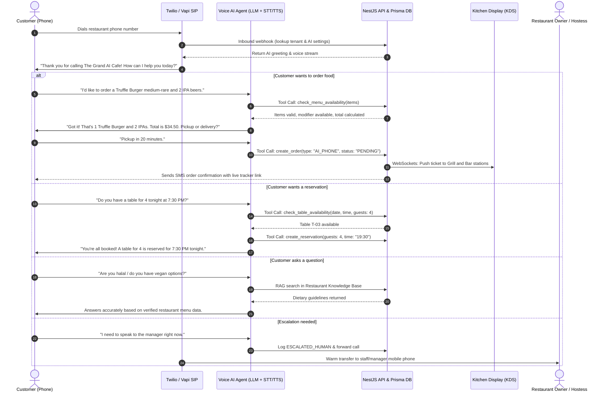

# AI Restaurant Receptionist — Comprehensive System Manual & Architectural Blueprint

> **Purpose of this Document:**  
> This manual serves as a complete technical, operational, and architectural reference for the **AI Restaurant Receptionist** platform. It is structured so that any AI model, software engineer, or stakeholder can immediately understand the architecture, user flows, database models, voice pipelines, and operational dashboards to discuss, plan, and build new capabilities.

---

## 1. Executive Summary & Value Proposition

### 1.1 What Is It?
**AI Restaurant Receptionist** is a multi-tenant, production-grade SaaS platform designed specifically for the restaurant and hospitality industry. It replaces or supplements the physical front desk phone receptionist with an intelligent, 24/7 conversational voice AI agent.

### 1.2 Core Problems Solved:
1. **Missed Calls During Peak Hours:** In busy restaurants, phone calls go unanswered when hostesses and servers are seating customers or serving tables. This leads to lost revenue from takeaway/delivery orders and table bookings.
2. **Order Taking Errors:** Background restaurant noise often causes staff to mishear phone orders, resulting in food waste, customer complaints, and chargebacks.
3. **Staffing Shortages & Overhead:** Hiring dedicated phone operators is expensive and difficult to scale during rush hours or off-hours.
4. **Instant Multi-Lingual & 24/7 Service:** The AI takes reservations and orders at 3:00 AM, in multiple languages, and never puts customers on hold.

---

## 2. Platform Architecture & Technology Stack

The platform is structured as a high-performance **pnpm monorepo**:

```
ai-restaurant-receptionist/
├── apps/
│   ├── frontend/             # Next.js 15 (App Router, Turbopack, Tailwind CSS, shadcn/ui)
│   └── backend/              # NestJS (TypeScript, REST APIs, WebSockets, Swagger)
├── packages/
│   ├── config/               # Shared constants, supported currencies, global app config
│   ├── database/             # Prisma ORM schema, migrations, and database seeders
│   ├── eslint-config/        # Shared linting standards
│   ├── tsconfig/             # Shared TypeScript compiler options
│   ├── types/                # Shared TypeScript contracts and DTO interfaces
│   ├── ui/                   # Reusable UI component library (shadcn/ui based)
│   └── utils/                # Shared helper functions
├── docker-compose.yml        # Local infrastructure (PostgreSQL 16, Redis 7)
└── package.json              # Monorepo root orchestration
```

### 2.1 Technology Stack Details:
- **Frontend App (`apps/frontend`):**
  - **Framework:** Next.js 15 (App Router) running with Turbopack on port `4000`.
  - **Styling:** Tailwind CSS + custom UI design tokens.
  - **Component Library:** `@ai-restaurant/ui` with Lucide icons.
  - **State & Data Fetching:** TanStack React Query + React Hook Form + Zod validation.
  - **Auth:** Firebase Client SDK + Session Tokens.

- **Backend API (`apps/backend`):**
  - **Framework:** NestJS 10 (Node.js) on port `3001`.
  - **API Documentation:** Interactive Swagger UI at `http://localhost:3001/api/docs`.
  - **Security:** Helmet, CORS tenant whitelisting, rate limiting, and class-validator DTO pipes.
  - **Multi-Tenancy:** Automated tenant resolution via `TenantMiddleware` extracting restaurant ID from JWT claims or subdomains.

- **Database Layer (`packages/database`):**
  - **ORM:** Prisma ORM.
  - **Database Engine:** PostgreSQL (multi-tenant shared database with strict `tenantId` foreign key isolation).

- **Queues & Asynchronous Jobs:**
  - **Engine:** Redis 7 with BullMQ for call webhooks, SMS notification dispatch, and kitchen printing jobs.

- **Voice & Telephony Pipeline:**
  - **Telephony Ingestion:** Twilio Voice, Vapi.ai, or Retell AI SIP trunking.
  - **Speech-to-Text (STT):** Deepgram Nova-2 or OpenAI Whisper (<300ms transcription).
  - **LLM Engine:** OpenAI GPT-4o / Claude 3.5 Sonnet with function calling (Tools).
  - **Text-to-Speech (TTS):** ElevenLabs / Deepgram Aura for human-like conversational voice synthesis (<350ms time-to-first-byte).

---

## 3. End-to-End System Workflow



---

## 4. Frontend Route Structure & Feature Walkthrough

The frontend web portal is accessible at **`http://localhost:4000`**.

### 4.1 Public & Authentication Routes
| Route | Description |
| :--- | :--- |
| `/` | Landing page with quick links to Login and Owner Dashboard. |
| `/login` | Secure multi-tenant login portal with Firebase Auth. |
| `/register` | Restaurant tenant signup and account creation. |
| `/forgot-password` | Password reset flow. |
| `/onboarding` | 3-step setup wizard: Restaurant details, operating currencies (including PKR, USD, EUR), timezone, and active modules. |

### 4.2 Owner & Staff Dashboard Routes (`/dashboard`)
| Route | Module | Key Capabilities |
| :--- | :--- | :--- |
| `/dashboard` | **Overview** | High-level metrics: total reservations, active incoming calls, and platform health. |
| `/dashboard/orders` | **Order Management** | Filter orders by type (`AI PHONE`, `Dine-In`, `Delivery`, `Takeaway`) and status (`Pending`, `Cooking`, `Ready`). View order breakdown, live station status (Kitchen vs Bar), and step-by-step progress timeline. |
| `/dashboard/orders/kds` | **Kitchen Display (KDS)** | Full-screen interactive touch display for cooks to accept tickets, bump items, and mark orders ready. |
| `/dashboard/orders/delivery` | **Delivery Dispatch** | Driver assignment, map routing, and delivery address tracking. |
| `/dashboard/reservations` | **Table Booking** | Timeline view of tables (5:00 PM to 10:00 PM), guest counts, party sizes, and reservation status. Tracks bookings made by `AI_AGENT`. |
| `/dashboard/reservations/floor-plan` | **Floor Plan** | Visual restaurant layout showing occupied, reserved, and open tables. |
| `/dashboard/reservations/waitlist` | **Waitlist** | Real-time guest queue with estimated wait times and SMS notifications. |
| `/dashboard/ai-logs` | **AI Observability** | Session tracking for every phone call. Audio playback, word-for-word transcripts, LLM token counts, latency metrics, and guardrail block analysis. |
| `/dashboard/settings/ai/prompt-builder` | **AI Personality** | Custom system prompt configuration, tone of voice, upsell instructions, and allergy safety rules. |
| `/dashboard/voice` | **Telephony & Numbers** | Twilio/Vapi assigned phone numbers, voice synthesis selection, fallback escalation numbers. |
| `/dashboard/menu` | **Menu Catalog** | Categories, menu items, variants (sizes), modifiers (spice levels, dressings), add-ons, and combo deals. |
| `/dashboard/settings` | **General Settings** | **AI Call Auto-Answering toggle switch (ON/OFF)**, multi-currency selector (**PKR**, USD, EUR, GBP, AED, SAR, etc.), VAT settings, receipt auto-printing. |
| `/dashboard/restaurant` | **Profile** | Restaurant brand name, legal name, description, cuisine type, address, contact email/phone. |
| `/dashboard/hours` | **Operating Hours** | Weekly opening/closing hours per service (Dine-in, Kitchen, Delivery) + Holiday schedules. |
| `/dashboard/customers` | **CRM** | Customer profiles, phone numbers, VIP tiers (Bronze, Gold, Diamond), Lifetime Value (LTV), and full event timeline. |
| `/dashboard/billing` | **SaaS Billing** | Subscription plans (Starter, Pro, Business, Enterprise) and Stripe payment management. |

---

## 5. Key System Features Implemented

### 5.1 AI Call Auto-Answering Toggle Switch
Located on **`http://localhost:4000/dashboard/settings`**:
- **When ON:** The AI receptionist immediately picks up incoming telephone calls on the 1st ring, converses with customers naturally, takes orders, and books tables.
- **When OFF:** The AI is paused (`DISABLED`). Incoming phone calls automatically bypass the AI and ring directly to the staff phone line or manager's phone.

### 5.2 Multi-Currency Support (Top 20 Currencies + PKR)
Configured in `packages/config` and selectable in both **Settings** and **Onboarding**:
1. **PKR (Rs)** — Pakistani Rupee
2. **USD ($)** — US Dollar
3. **EUR (€)** — Euro
4. **GBP (£)** — British Pound
5. **AED (AED)** — UAE Dirham
6. **SAR (SAR)** — Saudi Riyal
7. **CAD (CA$)** — Canadian Dollar
8. **AUD (A$)** — Australian Dollar
9. **JPY (¥)** — Japanese Yen
10. **INR (₹)** — Indian Rupee
11. **CNY (¥)** — Chinese Yuan
12. **CHF (CHF)** — Swiss Franc
13. **SGD (S$)** — Singapore Dollar
14. **QAR (QAR)** — Qatari Riyal
15. **KWD (KWD)** — Kuwaiti Dinar
16. **TRY (₺)** — Turkish Lira
17. **MYR (RM)** — Malaysian Ringgit
18. **NZD (NZ$)** — New Zealand Dollar
19. **BRL (R$)** — Brazilian Real
20. **ZAR (R)** — South African Rand

---

## 6. Database Schema Overview (Prisma ORM)

The complete schema is located at `packages/database/prisma/schema.prisma` (1,280+ lines). Below are the essential models:

### 6.1 Multi-Tenant Core:
- **`Tenant`**: Root entity for each restaurant. Holds legal name, brand name, timezone, default currency, status (`ACTIVE`, `SUSPENDED`), and relations to all restaurant data.
- **`Address`** & **`BusinessHours`**: Physical address and weekly/holiday schedule breakdown.

### 6.2 Orders & Kitchen (KDS):
- **`Order`**: Tracks individual orders. Fields include `orderNumber`, `type` (`AI_PHONE`, `DINE_IN`, `DELIVERY`, `TAKEAWAY`), `status` (`PENDING`, `COOKING`, `READY`, `DELIVERED`), pricing snapshot (`subtotal`, `taxTotal`, `tip`, `grandTotal`), `isPaid`, and timestamps.
- **`OrderItem`**: Specific items ordered, linking to `menuItemId`, selected variants, and modifiers.
- **`KitchenStation`**: Cooking stations (`Grill`, `Pizza`, `Bar`, `Dessert`) for kitchen routing.

### 6.3 Reservations:
- **`Reservation`**: Tracks table bookings. Fields include `reservationNumber`, `reservationDate`, `reservationTime`, `guests`, `status` (`CONFIRMED`, `SEATED`, `CANCELLED`), `source` (`AI_RECEPTIONIST`, `WEBSITE`, `PHONE`), and `createdBy` (`AI_AGENT`).
- **`Table`** & **`RestaurantFloor`**: Physical seating layout, table capacity, and indoor/patio areas.

### 6.4 Voice & AI Observability:
- **`ConversationSession`**: Complete conversational session log. Stores channel (`VOICE`, `SMS`, `WHATSAPP`), outcome (`PLACED_ORDER`, `BOOKED_RESERVATION`, `ESCALATED_HUMAN`), token consumption, and latency.
- **`CallRecord`**: Raw telephony log. Stores Twilio/Vapi `callSid`, caller `fromNumber`, `durationSeconds`, audio `recordingUrl`, and text `transcriptUrl`.
- **`AiSettings`**: System prompt, temperature, voice model ID, guardrail intervention thresholds, and escalation phone numbers.

### 6.5 Customer CRM:
- **`Customer`**: Customer directory indexed by phone number, email, loyalty points, and VIP tier (`BRONZE`, `SILVER`, `GOLD`, `DIAMOND`).
- **`CustomerTimeline`**: Immutable audit log of every interaction (`PHONE_CALL`, `ORDER`, `RESERVATION`, `AI_CONVERSATION`).

---

## 7. AI Voice Receptionist Implementation Guidelines

When discussing or building the conversational AI agent pipeline:

### 7.1 System Prompt Architecture
The AI agent operates with a strict persona and functional boundaries:
1. **Persona:** Professional, warm, efficient restaurant receptionist.
2. **Speech Constraints:** Speak in short, natural sentences suitable for audio synthesis (avoid bullet points or long lists over the phone).
3. **Menu Knowledge:** Recommend popular items and explicitly confirm variants (e.g., meat temperature, drink sizes).
4. **Allergen Guardrails:** If a customer mentions an allergy (e.g., peanuts, gluten), cross-reference with the item's allergen tags. If uncertain, escalate to a human.
5. **Confirmation Loop:** Always repeat order items and the total price before placing the order.

### 7.2 Tool (Function) Definitions for the LLM
The voice agent has direct access to backend tools via JSON Schema function calling:
- `get_menu(category?: string)`: Fetch available items, prices, and out-of-stock items.
- `check_table_availability(date: string, time: string, party_size: number)`: Checks capacity.
- `create_reservation(customer_name: string, phone: string, time: string, party_size: number)`: Confirms booking.
- `create_order(items: Array<{id: string, quantity: number, modifiers: string[]}>, fulfillment: string)`: Generates order ticket.
- `escalate_to_staff(reason: string)`: Triggers phone transfer to the manager line.

---

## 8. Development & Deployment Reference

### 8.1 Prerequisites:
- **Node.js:** v20+ or v24+
- **Package Manager:** `pnpm` (v9+ or v11+)
- **Database:** PostgreSQL 16
- **Cache/Queue:** Redis 7

### 8.2 Starting the Platform Locally:
```bash
# 1. Install dependencies
pnpm install

# 2. Run database migrations / push schema
pnpm --filter @ai-restaurant/database run db:push

# 3. Start development servers
pnpm dev
# Frontend runs at: http://localhost:4000
# Backend runs at:  http://localhost:3001
# Swagger docs at:  http://localhost:3001/api/docs
```

### 8.3 Git Repository:
- **Remote:** `https://github.com/sohaib2good-source/AI-call-reciver`
- **Main Branch:** `main`
- **Workspace Isolation:** All activities and commands must strictly stay within this workspace (`AI restaurant`).

---

*Document version: 1.0.0 — Generated for AI architectural review and feature planning.*
